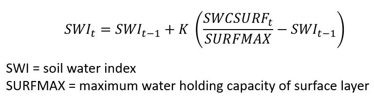
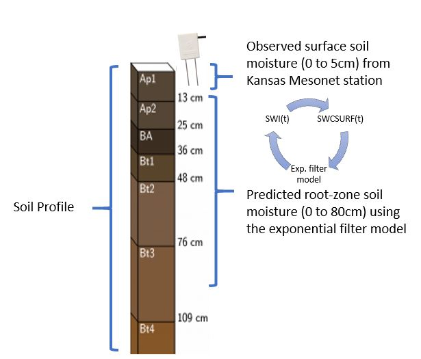

# Implementing an exponential filter model to estimate soil moisture in the entire root-zone

**Name**: Pedro Rossini  
**Semester**: Spring 2019  
**Project area**: Agronomy

## Objective

Implement a python code to estimate daily soil water content of the entire root-zone from surface observations using an exponential filter model.

## Outcomes

I would like to predict daily soil moisture to the entire profile (0 to 80 cm) from daily soil moisture mesurements at surface (0 to 5 cm) depth. 
I will crete an output file .csv with daily API index, daily root-zone moisture prediction and the accuracy of the model. Moreover, I'll show a figure with the root-zone water content predicted by the model vs. the observed root-zone water content from Mesonet station.

## Rationale

Accurate measurement of soil water content at root-zone remains decisive in agriculture, hydrology, ecology and climatology. An innovative alternative to tackle this is using an exponential filter model to predict the entire root-zone moisture from soil moisture observations at surface (0-5cm). 

Exponential filter model is a semi-mechanistic model to estimate soil water index (SWI) of the root-zone from the soil observations at the surface. The model has only 3 parameters, SWCSURF that represent the soil moisture observed at the surface, SURFMAX that represent the maximum amount of water that the surface can hold and K is a parameter that range between 0 to 1 and is realted to the gaps between observations. 

 

 
 

Initial SWI (SWI =1) will be estimated using soil moisture observation from the Mesonet station (0-5cm depth) divided by the maximum amount of water that the layer can hold.
Daily soil moisture observations at 5cm depth from Kansas Mesonet will be use as a main input of the model (SWCSURF(t)). On the other hand, daily soil moisture observations at 10, 20, and 50cm depth will be used to calibrate and validate the model.

## Sketch
 

## References
Albergel, Clément, et al. "From near-surface to root-zone soil moisture using an exponential filter: an assessment of the method based on in-situ observations and model simulations." Hydrology and Earth System Sciences 12.6 (2008): 1323-1337.

